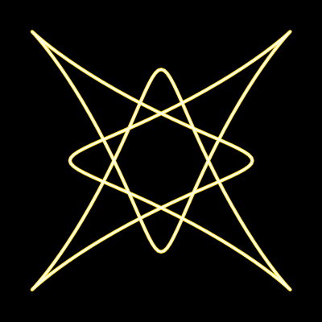

# Spirograph

A simple visualization program that uses a composition of virtual
circular drives to draw geometric figures on screen.
Different drive setups create various circular figures.
Some basic setups are provided in `Samples` directory.

Requirements
------------

* *Windows 7* or higher.
* *.NET Framework v4.6.2* or higher.

Downloads
---------

You can download the source code and compiled packages
[here](https://github.com/Egiraht/Spirograph/releases).

License
-------

Copyright (C) 2019 Maxim Yudin <<stibiu@yandex.ru>>

Software license statement can be found in [LICENSE.txt](LICENSE.txt).

References
----------

The program targets *Microsoft .NET Framework v4.6.2*

It also uses the following Nuget packages and their dependencies:
* MonoGame framework (https://www.nuget.org/packages/MonoGame.Framework.WpfInterop)
* SharpDX (https://www.nuget.org/packages/SharpDX/)

Links
-----

**Spirograph** project GitHub page: https://github.com/Egiraht/Spirograph
